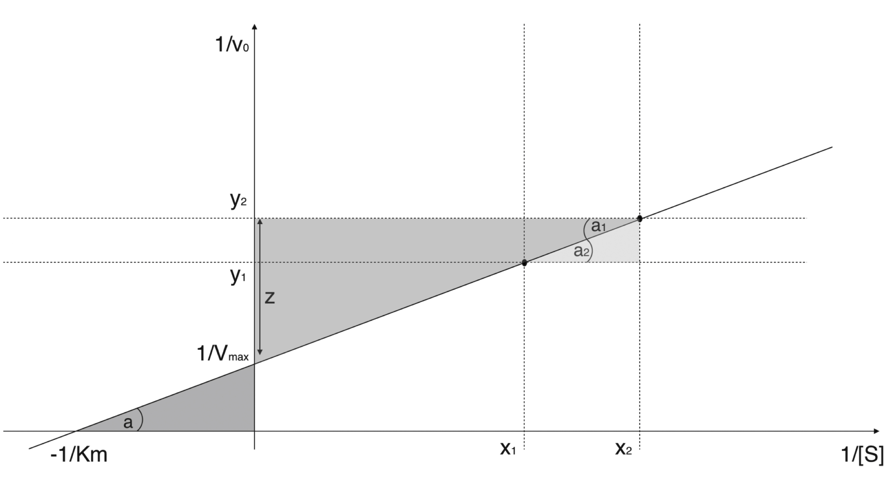
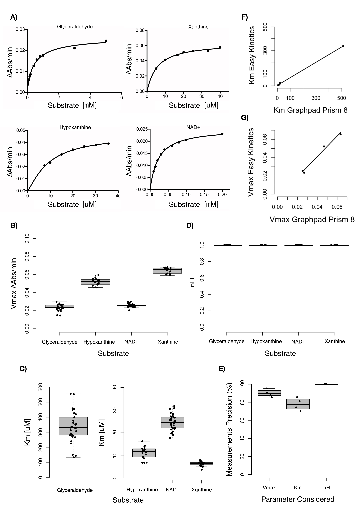

---
title: 'Easy Kinetics: a novel enzyme kinetic characterization software'

tags:
  - C# 
  - Enzymology
  - computational kinetics

authors:
  - name: Gabriele Morabito
  - affiliation: 1 
  
affiliations:
 - University of Pisa, Pisa, Italy
 - index: 1
 
date: 24 January 2021
bibliography: paper.bib

--------

# Summary
Easy Kinetics is an open source software that allows the rapid evaluation of the main kinetics parameters in an enzymatic reaction. In contrast to other similar commercial software that use algorithms based on regression models, known to have several limitations [1], Easy Kinetics uses a novel original algorithm based on a trigonometric demonstration, requiring in input the spectrophotometric measurements of ∆Abs/min taken twice at only two different substrate concentrations. The results generated show a significant concordance with those ones obtained with the most common commercial software used for enzyme kinetics characterization, GraphPad Prism 8 [2], suggesting that Easy Kinetics can be used for routine tests in enzyme kinetics as an alternative valid software.

# Statement of need
The continuous and rapid evolution of modern biochemical methods make the study of enzyme’s kinetic very useful both in academic research, to test how interesting polypeptidic chain’s variation impact on enzymes functionality, and in industrial processes, to optimize the production processes of the molecules of interest in enzymatic reactors [3]. The Michaelis-Mentem reaction mechanism was proposed almost a century ago to describe how the reaction speed of enzymes is affected by the substrate’s concentration [4], and it’s still the core reference model to describe enzymes kinetics. This model however requires a few parameters to fit the raw data: nH, Km and Vmax. Several methods were developed by biochemists during years to evaluate these parameters from the raw data, the most used of which allow software like GraphPad Prism 8 [2] to apply linear or non-linear regression model [5]. Original alternative methods for Km and Vmax determination were proposed, which graphically determine these values [6], but like the previous ones they require multiple spectrophotometric measurements of ∆Abs/min (at least 6 conducted in duplicate) at different substrate concentrations to precisely determine the main kinetic parameters. Easy kinetics uses an alternative method which allows determination of the main kinetics parameters of an enzyme catalyzed reaction and the corresponding kinetics graphs, by the spectrophotometric measurements of ∆Abs/min taken twice at only two different substrate concentrations.

# Software implementation and distribution
Easy Kinetics was developed in C# language with a GPL-3.0 license, both for the versatility of C# and the design object-oriented, for Windows 10 environment (with October update installed), because of the diffusion of Windows 10 and the consequent ease of software distribution. The software installation package can be downloaded freely as windows application on Microsoft Store at the URL:https://www.microsoft.com/it-it/p/easy-kinetics/9nx1f4q5fpg5?activetab=pivot:overviewtab) or alternatively on the repository GitHub (DOI: 10.5281/zenodo.3242785) at the URL:https://github.com/ekin96/EasyKinetics. Easy Kinetics allows the user to operate in 5 different environments several kinetics analyses: “Simple Enzyme Kinetics”, “Inhibition Kinetics”, “Enzymatic Units Assay”, “Calculation of ∆Abs/min”, “Bradford Assay”. Furthermore Easy Kinetics was optimized to self-detect possible substrate-inhibition kinetics.

# Algorithm used in evaluation of Km and Vmax
The evaluation of Km and Vmax by the spectrophotometric measurements of ∆Abs/min taken twice at only two different substrate concentrations, is based on a trigonometric demonstration (Fig.1). Briefly the algorithm transforms the mean of the duplicates at the two measurements in their reciprocal values, considering the Lineweaver-Burk reciprocal plot. Known two points of this graph, it’s universally accepted that they can be joined by one and only one straight line. This line will have an unknown inclination "a" and will intersect the Cartesian axes in points  and  also unknown. However by tracing the projections of the two known points (,) and (,) on the Cartesian plane, it is evident that the parallel lines y =  and y = 0 intersect the studied straight line. By the Alternate Interior Angles theorem [7], if two parallel lines are cut by a transversal one, then the pairs of alternate interior angles are congruent: so, by Fig.1, "a" = "".  Considering instead the lines y =  and y = , which are also parallel and intersected by the studied straight line, for the same theorem discussed before, their internal alternate angles are congruent:  so, by Fig.1, "" = "". This implies that:

tan(a) = 

But also  = tan(a), with z =  - , so:

 =  - z =  - tan(a) *  =  - 

Once calculated , the value of  can be determined as follow:

|| = /tan(a)

Inverting the two previous values,  and  will be finally found and from there by subsequent biochemical relations the other kinetic parameters will be deduced [8-11].

**Fig.1:** Graphical trigonometric demonstration of the Km and Vmax evaluation based on Lineweaver-Burk reciprocal plot

Since Easy Kinetics receives in input only two spectrophotometric measurements, despite being performed twice, if one of these measures is anomalous, it won’t be corrected by other measurements as occurs with regression models; so the software may fall in error. Thus to minimize experimental bias the algorithm is implemented to consider the ∆Abs/min at one substrate concentration only if both the duplicates fall within the range of their mean ± 10% of their average, otherwise the software suggest to repeat these measurements for the substrate concentration considered.

# Kinetic parameters generated with Easy Kinetics shows high accuracy and concordance with those ones generated by GraphPad Prism 8

In order to show Easy Kinetics accuracy in the evaluation of the main kinetic parameter, several time series absorbances were acquired for the enzymes aldehyde dehydrogenase and xanthine oxidase at different concentrations of several limiting substrates for the reaction they catalyzed (Tab.1, Fig.2A). 

**Tab.1** Experimentally measured ∆Abs/min values for several substrate’s concentrations in the enzyme’s catalyzed reactions tested. 

Then for each enzyme and each substrate the main kinetic parameters  ,   and   were generated using Easy Kinetics “Simple Enzyme Kinetics” environment and every two points non repeated permutation of the raw data. In this way it was possible to evaluate the precision of the previous parameters generated by the software as (1-C.V.) * 100 for  and , showing a normal distribution of values generated for all the tested substrates, and as (1-Q.C.V.) * 100 for  , showing a non normal distribution of the values generated for 3 of the tested substrates (Fig.2E). In summary the parameters generated show very good precision values for  (~90%) and  (100%) in all the reaction models, while a little less for  (~78%). Then the means values of  and medians values of  generated by Easy Kinetics for all the tested substrates were correlated with those ones generated by GraphPad Prism 8 [2] using the same input raw data (Fig.2F-G). The correlation analysis shows a significant Pearson’s linear correlation coefficient of 0.99 for  (t = 10.053, df = 2, p-value = 0.00975), with normally distributed values in both Easy Kinetics (W = 0.87392, p-value = 0.3133) and GraphPad Prism 8 (W = 0.88607, p-value = 0.3652) evaluations, and a significant Spearman correlation coefficient of 1 for  (S = 0, p-value = 0.08333), with non normally distributed values in both Easy Kinetics (W = 0.67175, p-value = 0.005173) and GraphPad Prism 8 (W = 0.65386, p-value = 0.002921) evaluations. Surprisingly  values generated for all the substrates tested by Easy Kinetics show a standard deviation δ = 0 around a mean of 1 don’t allowing any correlation test with the corresponding nH values generated by GraphPad Prism 8 [2]. Thus for every substrate tested it was evaluated the ratios between GraphPad 8 and Easy Kinetics generated  (0.846 for Glyceraldehyde, 1.249 for Hypoxanthine, 1.024 for NAD+ and 1.045 for Xanthine), showing a mean value of 1.041 with a standard error of se = 0.083 of the ratios normal distribution (W = 0.96402, p-value = 0.8042).

**Fig.2:** Simulations of enzymatic kinetics using Easy kinetics and GraphPad Prism 8: **A)** Kinetic curves of the two enzymes tested for different limiting substrates, respectively Xanthine or Hypoxanthine for bovine Xanthine oxidase and NAD+ or Glyceraldehyde for bovine Aldehyde dehydrogenase, all the curves were generated using GraphPad Prism 8. **B-D)** Boxplots representing the distributions of Vmax, Km and nH values generated with Easy Kinetics using every two points non repeated permutation of the raw data experimentally obtained. Glyceraldehyde values show a normal distribution for Km (W = 0.96956, p-value = 0.4494) and nH, while a non normal distribution for Vmax (W = 0.89738, p-value = 0.003915). Hypoxanthine values show a normal distribution for Vmax (W = 0.96286, p-value = 0.6576), Km (W = 0.94657, p-value = 0.3738) and nH. NAD+ values show a normal distribution for Km (W = 0.98863, p-value = 0.9728) and nH, while a non normal distribution for Vmax (W = 0.90018, p-value = 0.004639). Xanthine values show a normal distribution for Km (W = 0.95116, p-value = 0.4751) and nH, while a non normal distribution for Vmax (W = 0.88084, p-value = 0.03281). Values outliers in position: 1,7,8,33,38,40,42,51,78,87,105 of the two point non repeated permutations dataset were eliminated for differing too much in Vmax and/or Km estimation from the central value of the distribution. **E)** Boxplots representing the precision of Vmax, Km and nH distribution central value for all the enzymes and limiting substrate tested (n=4), since Km and nH show a normal distribution of values for all the tested substrates, the precision of the estimation was calculated as (1-C.V.) * 100, while for Vmax showing non normal distribution for 3 of the tested substrates, the precision was calculated as (1-Q.C.V.) * 100. C.V. refers to the coefficient of variation while Q.C.V. to the quartile based coefficient of variation. **F-G)** scatterplots showing the linear correlation between the Vmax and Km generated both by Easy Kinetics (n=4) and GraphPad prism 8 (n=4). The tested substrates show a normal distributions of medians values for Vmax generated using Easy Kinetics (W = 0.87392, p-value = 0.3133) and of values generated using GraphPad Prism8 (W = 0.88607, p-value = 0.3652), allowing use of Pearson’s linear correlation test, while a non normal distribution of mean values for Km generated using Easy Kinetics (W = 0.67175, p-value = 0.005173) and of values generated using GraphPad Prism8 (W = 0.65386, p-value = 0.002921), allowing use of Spearman’s correlation test.

# Acknowledgements

The author declares no conflicts of interests. No funding from any public or private organizations has been used to perform this research. Enzyme’s Kinetics raw data were measured in independent tests inside the Biochemical Department of the University of Pisa. Both the source code and the compiled software are available freely for any user on GitHub.  All measures, calculations and exclusions of the data were reported. Sample size was determined before any data analysis.

# References

